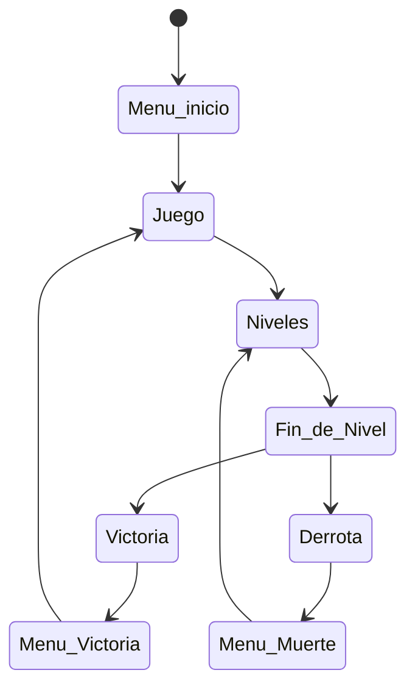
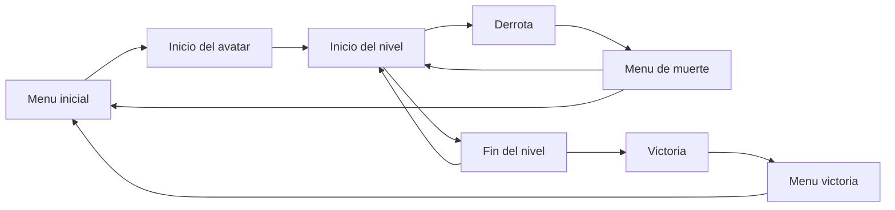
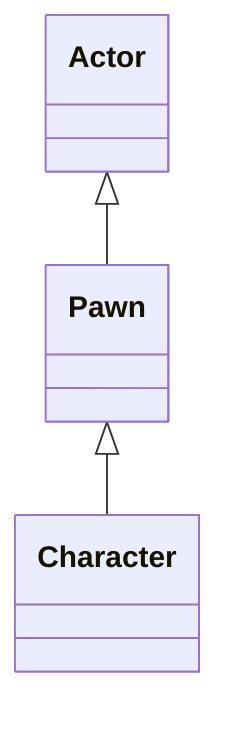

# DEV25-Sanchez
Proyecto Final de la asignatura de DEV del MII de la UCM

## Descripcion
Se trata de un prototipo basico de videojuego de plataformas 2D para Unreal Engine 5.6 en el que controlamos a un personaje que debe avanzar por una serie de niveles en los que se encontrara enemigos y puzzles que le cortaran el paso.

## Punto de partida
El punto de partida de este proyecto es la plantilla en blanco, ya que no existe ninguna para juegos 2D. 

## Instalacion y uso
Los ficheros mas importantes del proyecto estan disponible en este repositorio, aunque algunos ficheros binarios potencialmente grandes estan en el almacen GitHub LFS asociado, y por lo tanto se requiere tener activa la extension Git LFS cuando lo descarguemos con GitHub Desktop o similar. 

El resto de los ficheros, generalmente de contenido muy pesado o creado por terceros y sin intencion de ser modificado en este proyecto, tendra que descargarse de carpetas compartidas en Google Drive con ficheros ZIP, para despues descomprirlos directamente en la carpeta Content. Bastante contenido comun a todos los proyectos (StarterContent, LevelPrototyping, FirstPerson, ETC.) esta [disponible con acceso general aqui](https://drive.google.com/drive/u/0/folders/1TfoB5S3yQw49-onoFfn0q79PTfk2RoSE) para su descargar.

Para facilitar esta descarga podemos crear un fichero de PowerShell que haga ese trabajo con nosotros: en bucle empezar a descargar uno a uno los ficheros ZIP del contenido, a traves del ID publico de las carpetas compartidas en Google Drive y si no hay carpetas ya con esos nombres dentro de Content, luego descomprimir y volcar cada uno de ellos en la carpeta Content, destruyendo el fichero ZIP antes de descargar el siguiente. Hay que recordar que los archivos descomprimidos de cada zip deben estar en una unica carpeta con el nombre del fichero zip como subcarpeta de Content.

Al no estar publicada todavia ninguna version ejecutable del prototipo, ni enlazado ningun video con las pruebas realizadas, es necesario abrir el proyecto en Unreal Engine y jugarlo desde alli.

## Preproduccion

El diseño tiene estas secciones:
- [Estetica](#Estetica)
  * [Graficos](#Graficos)
  * [Sonidos](#Sonidos)
- [Dinamica](#Dinamica)
  * [Objetivo](#Objetivo)
  * [Castigo](#Derrota)
- [Mecanica](#Mecanica)
  * [Avatar](#Avatar)
  * [Objetos del mapa](#Objetos)
  * [Enemigos](#Enemigos)
  * [Menu de inicio](#MenuInicio)
  * [Menu de muerte](#MenuMuerte)
  * [Menu de victoria](#MenuVictoria)
  * [Interfaz de usuario](#Interfaz)
- [Contenido](#Contenido)
  * [Plataformas](#Plataformas)

### Estetica
El juego usa Unreal Engine 5.6.

#### Graficos

#### Sonidos

### Dinamica
La dinamica del juego consiste en avanzar por una serie de niveles con distintas mecanicas, enemigos y puzzles, terminando el juego al alcanzar el final de estos niveles. Existe un sistema de vidas y combate, al ser derrotados empezaremos desde el ultimo punto de control.

un enfrentamiento entre dos equipos que compiten por ver quien es capaz de parar 5 veletas antes, no existe muerte como tal pero durante el juego el jugador y los enemigos pueden dispararse entre si, quedando muy pringados y pudiendo sabotear el disparo del personaje.

#### Objetivo
El objetivo del juego es llegar hasta el final de cada nivel superando los obstaculos.

#### Castigo
El jugador puede morir, pero reaparece en el ultimo punto de control. Al reaparecer, los enemigos derrotados y algunos obstaculos tambien reaparecen.

### Mecanica
A continuacion detallamos el contenido mas importante del juego.

#### Avatar

#### Enemigos

#### Menu de inicio
Permitira al jugador comenzar el juego.

#### Menu de muerte
Mostrara al jugador las opciones de reaparicion e ir al menu inicial.

#### Menu de victoria
Informara al jugador de su victoria y la opcion de ir al menu de inicio.

### Contenido
Estos son los diagramas de funcionamiento del juego. 

#### Plataformas

Tras el menu inicial, el juego comienza en el primer nivel, compuesto por diversas plataformas, objetos, enemigos y otros componentes. Solo se podra pasar al siguiente nivel superando el actual. Si el jugador muere se enviara al menu de muerte, donde podra decidir si empezar desde el ultimo punto de control o ir al menu inicial. Al llegar al final del untimo nivel se mostrara el menu de victoria.

A continuacion se muestran los borradores del diseño de los niveles.

## Produccion

Las tareas aun no se han realizado. 

| Estado  |  Tarea  |  Fecha  |  
|:-:|:--|:-:|
|  | Diseño: Primer borrador |  |

Lista de mecanicas implementadas y otras tareas relevantes:

Las clases principales que se desarrollaran seran las siguientes.

