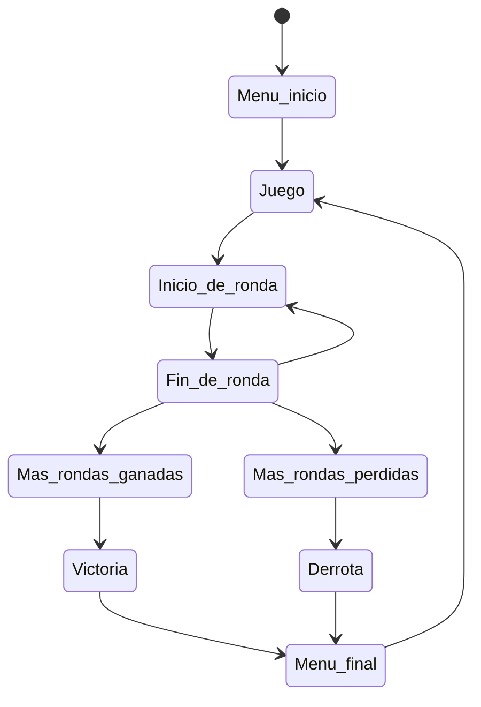
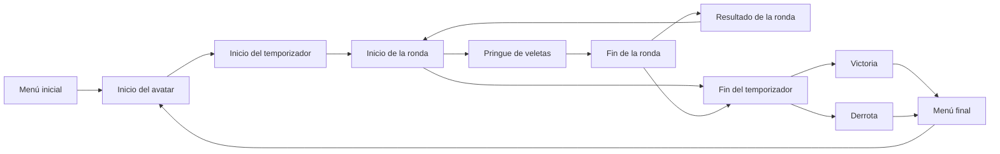
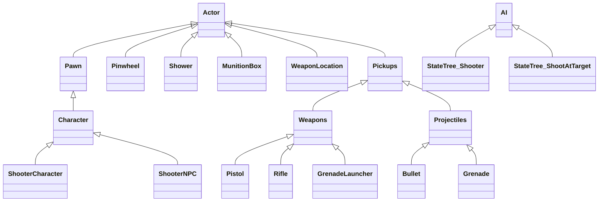

# DEV25-G01-P3
Práctica 3 de la asignatura de DEV del MII de la UCM

## Descripción
Se trata de un prototipo básico de videojuego de disparos 3D en primera persona para Unreal Engine 5.6 en el que controlamos a un personaje que debe disparar a una serie de veletas para marcar puntos para su equipo mientras un equipo enemigo compite contra ellos.

El enunciado que sirve de punto de partida para esta práctica puede encontrarse en la página de Narratech disponible aquí (https://narratech.com/es/desarrollo-de-videojuegos/herramientas/pringa-veletas/). Este enunciado contiene cinco secciones con distintos requisitos especificados de manera general en cada una.

En la primera sección se especifica que debe haber un mundo virtual que represente una arena de combate. En esta arena debe haber 9 veletas que serán los objetivos del juego. Aparecerán el jugador con un compañero y dos enemigos en distintos puntos de la arena, que también contendrá armas, recargas de munición y duchas. Habrá un menú al principio y al final de la partida.

En la segunda sección se indica que los personajes podrán interactuar con armas (pistolas, rifles y lanzagranadas), recargas de munición, duchas y veletas. Existirán interfaces que mostrarán el inventario del jugador, munición restante del arma actual y el estado del jugador. Las armas podrán recogerse del suelo y se añadirán al inventario del jugador. Los personajes pueden pringarse al ser disparados y si reciben suficiente pringue pasarán a estar “muy pringosos”. En este estado no podrán disparar y deberán interactuar con un a ducha para eliminar el pringue de su personaje.

En la tercera sección se concreta el funcionamiento de las veletas y la dinámica del juego. Tanto los personajes como las veletas mostrarán una barra encima de ellos que indican su nivel de pringue. Las veletas reducirán su velocidad al aumentar su pringue hasta detenerse al llenar su barra de pringue. En ese momento, la veleta tomará el color del equipo que haya disparado la última bala y se sumará un punto a ese equipo. Cuando un equipo haya sumado 5 puntos ganará la ronda y el nivel se reiniciará. En la pantalla también se mostrará un cronómetro de 5 minutos, las rondas ganadas y las veletas reclamadas en la ronda actual por cada equipo.

En la cuarta sección se concreta el comportamiento de los enemigos. Los enemigos deben comportarse de manera inteligente, detectando veletas y jugadores, conociendo el nivel de pringue de un objetivo pringable, persiguiendo, huyendo y disparando a objetivos hasta pringarlos del todo.

En la quinta sección se especifica que el juego debe ser sencillo de ganar empleando mecánicas básicas, sentido común y coordinación con el compañero del equipo, pero que el jugador no debería ganar si desatiende esos principios.

## Punto de partida
El punto de partida de este proyecto es la plantilla First Person con la variante Arena Shooter. 

## Instalación y uso
Los ficheros más importantes del proyecto están disponible en este repositorio, aunque algunos ficheros binarios potencialmente grandes están en el almacén GitHub LFS asociado, y por lo tanto se requiere tener activa la extensión Git LFS cuando lo descarguemos con GitHub Desktop o similar. 

El resto de los ficheros, generalmente de contenido muy pesado o creado por terceros y sin intención de ser modificado en este proyecto, tendrá que descargarse de carpetas compartidas en Google Drive con ficheros ZIP, para después descomprirlos directamente en la carpeta Content. Bastante contenido común a todos los proyectos (StarterContent, LevelPrototyping, FirstPerson, ETC.) está [disponible con acceso general aquí](https://drive.google.com/drive/u/0/folders/1TfoB5S3yQw49-onoFfn0q79PTfk2RoSE) para su descargar.

Para este proyecto en particular hace falta descargar los ficheros ZIP, que ya incluyen las carpetas del mismo nombre, para descomprimirlas directamente en Content: 
* Characters
* LevelPrototyping
* StarterContent
* Weapons
* FirstPerson
* Variant_Shooter
* _VR_Chat_Blender_UE__Spinning_Metallic_Pinwheel_-_Animated-7aecb135

Para facilitar esta descarga podemos crear un fichero de PowerShell que haga ese trabajo con nosotros: en bucle empezar a descargar uno a uno los ficheros ZIP del contenido, a través del ID público de las carpetas compartidas en Google Drive y si no hay carpetas ya con esos nombres dentro de Content, luego descomprimir y volcar cada uno de ellos en la carpeta Content, destruyéndo el fichero ZIP antes de descargar el siguiente. Hay que recordar que los archivos descomprimidos de cada zip deben estar en una única carpeta con el nombre del fichero zip como subcarpeta de Content.

Al no estar publicada todavía ninguna versión ejecutable del prototipo, ni enlazado ningún video con las pruebas realizadas, es necesario abrir el proyecto en Unreal Engine y jugarlo desde allí.

## Preproducción

El diseño tiene estas secciones:
- [Estética](#Estética)
  * [Gráficos](#Gráficos)
  * [Sonidos](#Sonidos)
- [Dinámica](#Dinámica)
  * [Objetivo](#Objetivo)
  * [Castigo](#Derrota)
- [Mecánica](#Mecánica)
  * [Avatar](#Avatar)
  * [Armas](#Armas)
  * [Veletas](#Veletas)
  * [Duchas](#Duchas)
  * [Cajas de munición](#Cajas)
  * [Enemigos y compañeros](#Enemigos)
  * [Menú de inicio](#MenuInicio)
  * [Menú de fin](#MenuFin)
  * [Interfaz de usuario](#Interfaz)
- [Contenido](#Contenido)
  * [Arena de combate](#Arena)

### Estética
El juego usa Unreal Engine 5.6 y parte del contenido de la plantilla First Person en su variante Arena Shooter, además de los paquetes Characters, LevelPrototiping y StarterContent.

#### Gráficos
El juego usa solamente el contenido de la plantilla First Person en su variante Arena Shooter y el de Starter Content.

#### Sonidos
No hay música ambiente.

### Dinámica
La dinámica del juego consiste en un enfrentamiento entre dos equipos que compiten por ver quién es capaz de parar 5 veletas antes, no existe muerte como tal pero durante el juego el jugador y los enemigos pueden dispararse entre sí, quedando muy pringados y pudiendo sabotear el disparo del personaje.

#### Objetivo
El objetivo del juego es ganar más rondas en cinco minutos que el equipo oponente. Para ganar una ronda se deben parar 5 veletas completamente.

#### Castigo
El jugador no puede morir, pero puede estar pringado y no poder realizar ciertas acciones como disparar. También puede perder la ronda, lo cual puede llevar a la derrota si sucede más veces de las que las que se gana la ronda.

### Mecánica
A continuación detallamos el contenido más importante del juego.

#### Avatar
El clásico maniquí de Unreal Engine que se puede mover e interactuar con el entorno, es el avatar que controla el jugador. En concreto puede recoger y disparar armas, recoger cajas de munición y usar duchas.

#### Armas
Armas que aparecerán por la arena y que los jugadores podrán recoger. Cada arma tiene su propia munición, capacidad máxima de munición, cadencia de disparo y daño de pringue. Al recoger una nueva arma tendrá su munición al máximo.
Habrá al menos tres tipos de arma:

* Pistola: Baja cadencia de disparo, baja capacidad de munición y bajo daño.
* Rifle: Alta cadencia de disparo, alta capacidad de munición y daño medio.
* Lanzagranadas: Baja cadencia de disparo, baja capacidad de munición y daño alto. Su disparo explotará en un área de efecto y dañará a todos los objetivos en el área.

#### Veletas
Veletas que giran. Su giro se parará al aumentar al máximo su nivel de pringue y cuando se paren otorgarán un punto de la ronda al equipo al que pertenezca el personaje que le haya acertado el último tiro. Las veletas tedrán una barra de vida que se irá llenando a medida que reciban daño. Esta barra de vida será visible al juagdor cuando se acerque a una veleta y desaparecerá cuando se aleje. También podrá ver la barra de vida de una veleta durante unos segundos al acertarle con un disparo desde lejos.

#### Duchas
Tendrán posiciones fijas en la arena. Los personajes podrán meterse en ellas para reducir su nivel de pringue. Mientras esté en una ducha siendo limpiado, el jugador verá una animación azul en los bordes de su pantalla para inidcarle que la ducha está funcionando.

#### Cajas de munición
El jugador tendrá una cantidad de munición limitada en cada arma y no podrá recargarla a menos que recoja una caja de munición. Aparecerán por la arena y los personajes podrán recogerlas. Al hacerlo se reestablecerá la munición de todas sus armas. Tras ser recogidas, las cajas de munición reaparecerán en la misma posición pasados 30 segundos.

#### Enemigos y compañeros
Personajes del equipo rival al del jugador y personaje compañero del equipo del jugador. Tendrán las mismas capacidades de interacción con el entorno que el jugador con las armas y las veletas y se comportarán de manera inteligente. Podrán detectar esos elementos, conocer el nivel de pringue de los objetivos, perseguir, huir y disparar. Tienen como objetivo disparar a las veletas, pero también podrán disparar a los personajes del equipo opuesto si así lo deciden. Además, al principio de una partida comenzarán desarmados y tendrán que encontrar y recoger un arma para poder disparar (aunque independientemente del arma que reocojan obtendrán siempre un rifle). 

Tanto enemigos como compañeros dispondrán de barras de vida que se comportarán de manera similar a las de las veletas, solo que son de otro color para diferenciarlas visualmente y su rango de aparición en relación a la cercanía del jugador es bastante mayor que el de las veletas.

#### Menú de inicio
Permitirá al jugador comenzar el juego. Tiene un botón de inicio con el texto "Jugar" que iniciará la partida.

#### Menú de fin
Informará al jugador del resultado de la partida, mostrándole un resumen de las rondas ganadas y perdidad y le permitirá reiniciar el juego pulsando el botón con el texto "Volver a jugar". Al pulsarlo todos los elementos del juego se reiniciarán a su estado y posición original.

#### Interfaz de usuario
Mostrará al jugador los siguientes elementos: inventario con armas recogidas, arma equipada, munición actual del arma equipada, nivel de pringue propio, nivel de pringue de los objetivos en pantalla (barra sobre cada veleta o personaje), tiempo restante de la partida, rondas ganadas, rondas perdidas, puntos obtenidos en la ronda por su equipo y puntos obtenidos en la ronda por el equipo enemigo. 

Como ya se ha indicado en sus relativas secciones, las barras de vida se aparecerán sobre las veletas, compañeros y enemigos de manera dinámica en función de lo cerca que esté el jugador o de si les ha dañado en los últimos segundos. 

Respecto al inventario de armas, inicialmente no será visible hasta que el jugador recoja un arma. Cuando lo haga aparecerá el icoco e índice del arma recogida en su inventario. Cada arma tiene una posición fija en el inventario, de modo que al recoger una misma arma en distintas rondas o partidas siempre aparecerá en la misma posición de la pantalla. Cada arma tiene un icono propio identificativo y un índice. El ínidce del arma equipada aparecerá en verde, de modo que el jugador siempre podrá saber qué arma de su inventario tiene equipada. El jugador puede pulsar Shift izquierdo para cambiar de arma y el índice verde se actualizará de manera dinámica.

A continuación se muestra un borrador del diseño de la interfaz de usuario. Las barras de las veletas y los iconos de veletas reclamadas o perdidas tendrían los colores de la munición del equipo correspondiente.

Además, entre rondas se mostrará una pantalla indicando el resultado de la ronda. El juego no se pausará durante los 2.5 segundos que se muestra este mensaje, pero el temporizador de la partida sí lo hará. 

### Contenido
Estos son los diagramas de funcionamiento del juego. 

#### Arena de combate

Tras el menú inicial, el juego comienza en una arena de combate en la que se desarrollarán las rondas durante cinco minutos. Al final de los cinco minutos, haya ganado o perdido el equipo del jugador, se le enviará al menú final, desde el que podrá reiniciar la partida. Al final de cada ronda se reiniciará el estado y posición de los jugadores, compañeros, enemigos y veletas.

A continuación se muestra un borrador del diseño de la arena de combate, indicando las posiciones de las veletas, las armas, las cajas de munición, las duchas y los puntos de aparición de los jugadores. La arena tendrá  una pasarela elevada central por debajo de la que se podrá pasar en las secciones indicadas. También se podrá subir a dos plataformas elevadas laterales perpendiculares más anchas que la pasarela pero de longitud de menos de la mitad de la arena. La mayor parte de los demás obstáculos estarán a una altura inferior a las de la pasarela y las plataformas laterales, de modo que se pueda saltar a ellas desde las anteriores, pero seguirán bloqueando completamente las líneas de visión desde el suelo de la arena.

## Producción

Las tareas se han realizado y repartido entre los autores. A continuación se muestra un vídeo del juego implementado (). 

| Estado  |  Tarea  |  Fecha  |  
|:-:|:--|:-:|
| ✔ | Diseño: Primer borrador | 2-12-2025 |
| ✔ | UI: Menú inicial | 4-12-2025 |
| ✔ | UI: Menú final | 8-12-2025 |
| ✔ | Diseño/Estética: Construcción de la arena de combate | 9-12-2025 |
| ✔ | Mecánica: Veletas | 11-12-2025 |
| ✔ | Mecánica: Lógica de la partida y ronda | 11-12-2025 |
| ✔ | UI: Interfaz de usuario durante la partida | 13-12-2025 |
| ✔ | IA: Detección de veletas | 17-12-2025 |
| ✔ | Mecánica: Cajas de munición y gestión de la munición | 17-12-2025 |
| ✔ | Mecánica: Duchas curativas | 17-12-2025 |
| ✔ | UI: Barras de vida para veletas y NPCs | 19-12-2025 |
| ✔ | IA: Personaje compañero de equipo | 21-12-2025 |
| ✔ | IA: Detección de armas | 22-12-2025 |
| ✔ | Mecánica: Reinicios entre rondas y entre partidas | 22-12-2025 |

Lista de mecánicas implementadas y otras tareas relevantes:

- [X] Mecánica: Veletas
      
- [X] Mecánica: Cajas de munición y gestión de la munición
      
- [X]  Mecánica: Duchas curativas

- [X] Mecánica: Lógica de la partida y ronda, asignación de puntos y reinicios entre rondas y partidas

- [X] UI: Menú inicial

- [X] UI: Menú final

- [X] UI: Interfaz de usuario durante la partida

- [X] UI: Barras de vida para veletas y NPCs

- [X] IA: Detección de veletas y armas

- [X] IA: Personaje compañero de equipo

- [X] Diseño/Estética: Construcción de la arena de combate

Las clases principales que se desarrollarán serán las siguientes.

